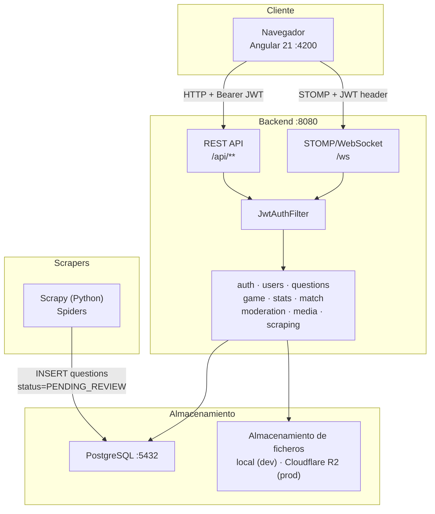
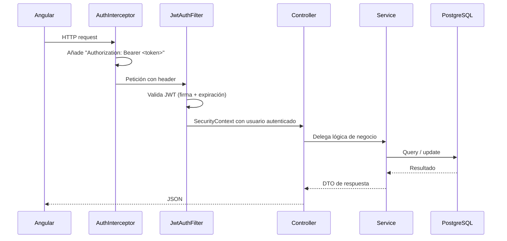

# Arquitectura del sistema

## Visión general

Versus es un monorepo con tres servicios independientes que se orquestan con Docker Compose. El frontend y el backend se comunican por HTTP/REST y WebSocket. Los scrapers publican preguntas directamente en la base de datos.



## Servicios

| Servicio | Tecnología | Puerto dev | Responsabilidad |
|---|---|---|---|
| Frontend | Angular 21, TypeScript | 4200 | SPA, UI de todos los modos de juego |
| Backend | Spring Boot 4, Java 21 | 8080 | REST API + WebSocket, lógica de negocio |
| Base de datos | PostgreSQL 18 | 5432 | Persistencia de todas las entidades |
| pgAdmin | pgAdmin 4 | 5050 | Administración de la BD (solo dev) |
| Scrapers | Scrapy, Python | — | Extracción de preguntas de la web |

## Flujo de una petición autenticada



Si el access token (15 min) ha expirado, `AuthInterceptor` intercepta el 401 y llama a `POST /api/auth/refresh` con el refresh token (7 días). Si el refresh también ha expirado, redirige a `/login`.

## Estructura de paquetes — Backend

```
com.versus.api/
├── config/          SecurityConfig, OpenApiConfig, DevSeedConfig
├── common/          GlobalExceptionHandler, ApiException, ErrorCode, ErrorResponse
├── auth/            JWT, refresh tokens, AuthController
├── users/           Perfil, UserController
├── questions/       Entidad Question + QuestionOption, aleatorización
├── game/            Lógica singleplayer Survival + Precision
├── match/           Entidades PvP (Sprint 3)
├── stats/           PlayerStats, Ranking
├── moderation/      QuestionReport, flujo de revisión
├── media/           Upload de avatares e imágenes
├── storage/         Abstracción local / Cloudflare R2
├── scraping/        Spider + SpiderRun, integración Scrapy
└── websocket/       STOMP config, canal JWT, eventos de partida
```

## Separación de responsabilidades

| Capa | Regla |
|---|---|
| **Controller** | Solo deserialización de entrada y serialización de salida. Sin lógica de negocio. |
| **Service** | Toda la lógica de negocio. Lanza `ApiException` ante invariantes rotos. |
| **Repository** | Acceso a datos con Spring Data JPA. Sin lógica. |
| **Domain** | Entidades JPA con anotaciones Lombok (`@Data`, `@Builder`). Sin comportamiento. |
| **DTO** | Objetos de transferencia inmutables (records o clases con `@Builder`). Nunca exponen entidades directamente. |

## Gestión de errores

Todos los errores pasan por `GlobalExceptionHandler` y producen el mismo envelope:

```json
{
  "error": "NOT_FOUND",
  "message": "Question not found",
  "status": 404
}
```

Códigos definidos en `ErrorCode`: `UNAUTHORIZED` (401), `FORBIDDEN` (403), `NOT_FOUND` (404), `CONFLICT` (409), `VALIDATION_ERROR` (400), `INTERNAL_ERROR` (500).

## WebSocket — arquitectura de canales

```
Cliente conecta a: ws://localhost:8080/ws  (SockJS fallback)
JwtChannelInterceptor valida el JWT en el frame STOMP CONNECT

Suscripción personal:  /user/queue/match     → eventos propios del jugador
Suscripción de sala:   /topic/match/{matchId} → broadcast de la partida

Envío de acciones:     /app/match/answer
                       /app/match/ready
```

Cada evento usa el envelope `MatchEventEnvelope`:

```json
{ "type": "ROUND_START | ANSWER_RESULT | GAME_OVER | ...", "matchId": "uuid", "payload": { ... } }
```

Ver documentación detallada en [backend/modules/websocket.md](../backend/modules/websocket.md).
