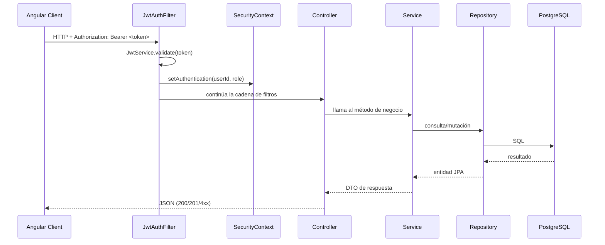

# Arquitectura general del backend

## Visión de capas

El backend sigue una arquitectura en capas clásica de Spring MVC, con separación clara entre:

```
┌─────────────────────────────────────────────┐
│              Clientes externos               │
│   Angular SPA (4200)  ·  Scrapy (futuro)    │
└───────────────┬──────────────────┬──────────┘
                │ HTTP/REST        │ WebSocket STOMP
┌───────────────▼──────────────────▼──────────┐
│             Controllers / Handlers           │
│    @RestController  ·  @MessageMapping      │
└───────────────┬─────────────────────────────┘
                │
┌───────────────▼─────────────────────────────┐
│                  Services                    │
│  @Service · @Transactional · Business logic │
└───────────────┬─────────────────────────────┘
                │
┌───────────────▼─────────────────────────────┐
│               Repositories                  │
│         Spring Data JPA · JpaRepository     │
└───────────────┬─────────────────────────────┘
                │
┌───────────────▼─────────────────────────────┐
│              PostgreSQL (5432)               │
└─────────────────────────────────────────────┘
```

## Mapa de paquetes

```mermaid
graph TD
    root["com.versus.api"]
    root --> config
    root --> common
    root --> auth
    root --> users
    root --> questions
    root --> game
    root --> match
    root --> stats
    root --> moderation
    root --> scraping
    root --> media
    root --> storage

    common --> common_exc["common.exception"]
    common --> common_dto["common.dto"]

    auth --> auth_domain["auth.domain"]
    auth --> auth_dto["auth.dto"]
    auth --> auth_repo["auth.repo"]

    users --> users_domain["users.domain"]
    users --> users_dto["users.dto"]
    users --> users_repo["users.repo"]

    questions --> q_domain["questions.domain"]
    questions --> q_dto["questions.dto"]
    questions --> q_repo["questions.repo"]

    game --> game_dto["game.dto"]

    match --> match_domain["match.domain"]
    match --> match_repo["match.repo"]

    stats --> stats_domain["stats.domain"]
    stats --> stats_dto["stats.dto"]
    stats --> stats_repo["stats.repo"]

    moderation --> mod_domain["moderation.domain"]
    moderation --> mod_repo["moderation.repo"]

    scraping --> scraping_domain["scraping.domain"]
    scraping --> scraping_repo["scraping.repo"]

    media --> media_domain["media.domain"]
    media --> media_dto["media.dto"]
    media --> media_repo["media.repo"]
```



## Flujo de una petición HTTP autenticada



## Módulos y sus responsabilidades

| Paquete | Responsabilidad única |
|---|---|
| `config` | Filtros de seguridad, CORS, Swagger, seeding de dev |
| `common.exception` | Jerarquía de excepciones, handler global, ErrorCode |
| `auth` | Registro, login, rotación de refresh token, JWT |
| `users` | Perfil propio y públicos, sin lógica de juego |
| `questions` | Acceso a preguntas activas (sin respuestas correctas en la respuesta) |
| `game` | Lógica de partidas singleplayer: Survival y Precision |
| `match` | Entidades de partida (usadas por `game` y futuro multiplayer) |
| `stats` | Estadísticas acumuladas por modo de juego |
| `moderation` | Reportes de preguntas por usuarios |
| `scraping` | Gestión de spiders y sus ejecuciones |
| `media` | Metadatos, permisos y API de assets multimedia |
| `storage` | Abstracción de almacenamiento local de archivos |

## Manejo de errores

Todas las excepciones de negocio pasan por `GlobalExceptionHandler` y producen siempre la misma forma de respuesta:

```json
{
  "error": "NOT_FOUND",
  "message": "Question not found",
  "status": 404
}
```

Ver [common.md](common.md) para la jerarquía completa.

## Seguridad

- **Sin estado**: `SessionCreationPolicy.STATELESS` — no hay sesiones HTTP.
- **JWT de doble token**: access token (15 min) + refresh token (7 días, almacenado como hash SHA-256).
- **CORS**: sólo permite `http://localhost:4200` en desarrollo.
- **Endpoints públicos**: `/api/auth/**`, `/v3/api-docs/**`, `/swagger-ui/**`.
- **Endpoints protegidos**: todo lo demás requiere Bearer token válido.

Ver [modules/auth.md](modules/auth.md) para detalles del flujo JWT.
