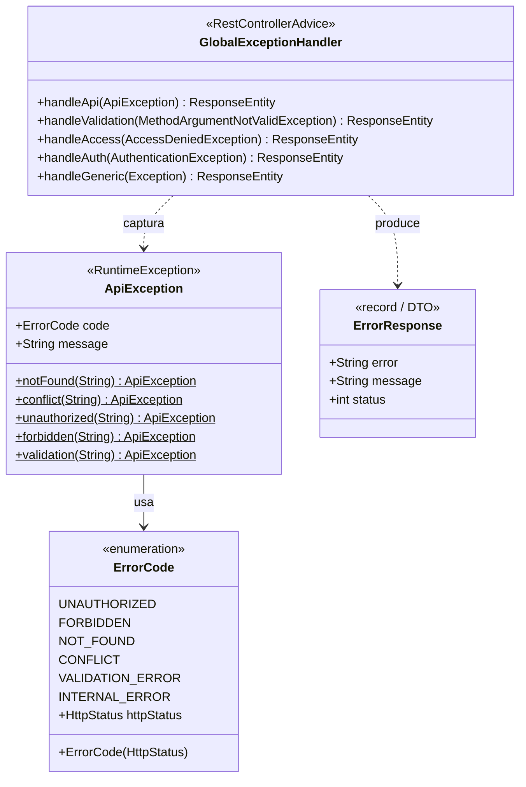
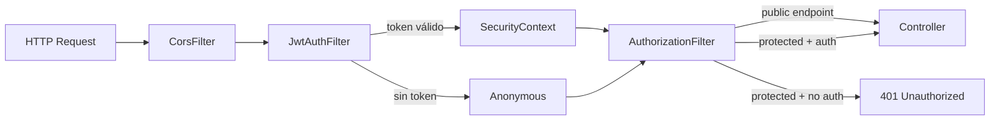

# Infraestructura común

Paquetes: `com.versus.api.common.exception`, `com.versus.api.common.dto`, `com.versus.api.config`

---

## Manejo de excepciones

### Diagrama de clases



### Tabla de códigos de error

| ErrorCode | HTTP | Cuándo se usa |
|---|---|---|
| `UNAUTHORIZED` | 401 | Token inválido, credenciales incorrectas |
| `FORBIDDEN` | 403 | Rol insuficiente, recurso ajeno |
| `NOT_FOUND` | 404 | Entidad no encontrada en BD |
| `CONFLICT` | 409 | Email/username ya registrado |
| `VALIDATION_ERROR` | 400 | Fallo de `@Valid` en DTO |
| `INTERNAL_ERROR` | 500 | Excepción no controlada |

### Patrón de uso en services

```java
// Lanzar excepción de negocio
throw ApiException.notFound("Question not found");
throw ApiException.conflict("Email already in use");

// Nunca lanzar excepciones genéricas en el dominio — siempre ApiException
```

---

## Configuración de seguridad (`SecurityConfig`)



**Beans expuestos por `SecurityConfig`:**

| Bean | Tipo | Propósito |
|---|---|---|
| `filterChain` | `SecurityFilterChain` | Define reglas de autorización y añade `JwtAuthFilter` |
| `corsSource` | `CorsConfigurationSource` | Permite `localhost:4200`, métodos estándar, headers auth |
| `passwordEncoder` | `BCryptPasswordEncoder` | Hasheo de contraseñas con BCrypt |
| `authenticationManager` | `AuthenticationManager` | Requerido por Spring Security para `AuthService` |

---

## Configuración de Swagger/OpenAPI (`OpenApiConfig`)

- Ruta de la spec: `GET /v3/api-docs`
- UI interactiva: `GET /swagger-ui.html`
- Esquema de seguridad: `bearerAuth` (JWT en cabecera `Authorization`)
- Sólo disponible en entornos que no bloqueen la ruta (dev y staging).

---

## Seeder de desarrollo (`DevSeedConfig`)

Activo sólo con `@Profile("dev")` y la propiedad `versus.seed.enabled=true`.

**Datos insertados:**

| Tipo | Cantidad | Detalle |
|---|---|---|
| Usuarios | 3 | player@test.com (PLAYER), mod@test.com (MODERATOR), admin@test.com (ADMIN) |
| Preguntas BINARY | ~15 | Categorías football, geography, history, science |
| Preguntas NUMERIC | ~10 | Con `correctValue`, `unit` y `tolerancePercent` |

Las contraseñas de los usuarios de seed son `password` (hasheadas con BCrypt). **Nunca usar en producción.**
