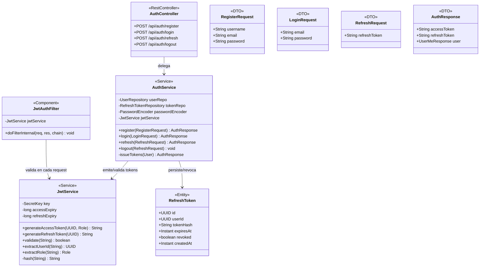
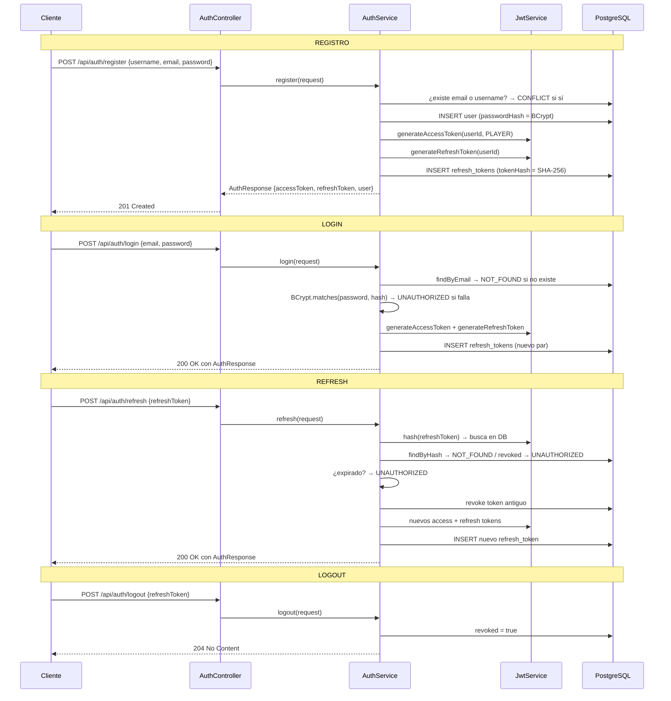

# Módulo: Autenticación & JWT

Paquete raíz: `com.versus.api.auth`  
Estado: ✅ implementado (Sprint 1)

---

## Responsabilidad

Gestiona el ciclo de vida de la identidad del usuario: registro, login, rotación de tokens y logout. Ningún otro módulo debe emitir ni validar tokens JWT — esa lógica reside exclusivamente aquí.

---

## Diagrama de clases



---

## Flujo de autenticación completo



---

## Estrategia JWT

### Access token
- **Algoritmo:** HS256 (HMAC-SHA256)
- **Duración:** 15 minutos (configurable via `versus.jwt.access-expiry`)
- **Claims adicionales:** `role` (String del enum `Role`)
- **Subject:** UUID del usuario (String)
- **Almacenamiento en cliente:** memoria o localStorage — no se persiste en servidor

### Refresh token
- **Duración:** 7 días (configurable via `versus.jwt.refresh-expiry`)
- **Almacenamiento:** se guarda únicamente el **hash SHA-256** en la tabla `refresh_tokens`
- **Rotación:** cada llamada a `/refresh` revoca el token anterior y emite un par nuevo

> **Por qué guardar sólo el hash:** Si alguien obtiene acceso de lectura a la BD, no puede reutilizar los tokens. El token original sólo lo tiene el cliente.

### Filtro JWT (`JwtAuthFilter`)

Se ejecuta en **cada request** antes del framework de autorización:

1. Lee la cabecera `Authorization: Bearer <token>`
2. Llama a `JwtService.validate(token)`
3. Si válido: extrae `userId` y `role`, crea `UsernamePasswordAuthenticationToken` y lo inyecta en `SecurityContextHolder`
4. Siempre llama a `chain.doFilter()` — la negación ocurre en la capa de autorización de Spring Security, no en el filtro

---

## Endpoints

| Método | Ruta | Auth | Body | Respuesta |
|---|---|---|---|---|
| `POST` | `/api/auth/register` | No | `RegisterRequest` | `201` `AuthResponse` |
| `POST` | `/api/auth/login` | No | `LoginRequest` | `200` `AuthResponse` |
| `POST` | `/api/auth/refresh` | No | `RefreshRequest` | `200` `AuthResponse` |
| `POST` | `/api/auth/logout` | No* | `RefreshRequest` | `204` |

*logout sólo requiere el refresh token en el body, no la cabecera Authorization.

### Errores comunes

| Situación | ErrorCode | HTTP |
|---|---|---|
| Email/username ya en uso | `CONFLICT` | 409 |
| Credenciales incorrectas | `UNAUTHORIZED` | 401 |
| Refresh token no encontrado / revocado | `UNAUTHORIZED` | 401 |
| Refresh token expirado | `UNAUTHORIZED` | 401 |
| Body inválido (`@Valid` falla) | `VALIDATION_ERROR` | 400 |

---

## Entidad: `RefreshToken`

```
Tabla: refresh_tokens
┌─────────────┬──────────────────────────────────────────┐
│ Columna     │ Notas                                    │
├─────────────┼──────────────────────────────────────────┤
│ id          │ UUID, PK                                 │
│ user_id     │ UUID, FK → users.id (indexed)            │
│ token_hash  │ VARCHAR, SHA-256 del token (indexed)     │
│ expires_at  │ TIMESTAMPTZ                              │
│ revoked     │ BOOLEAN, default false                   │
│ created_at  │ TIMESTAMPTZ, default now()               │
└─────────────┴──────────────────────────────────────────┘
```

No hay FK explícita en JPA hacia la entidad `User` para evitar cargas innecesarias — sólo se guarda el `userId` como UUID.

---

## Extensión futura

- Añadir `device_info` / `ip_address` a `RefreshToken` para mostrar "sesiones activas"
- Endpoint `GET /api/auth/sessions` para listar y revocar sesiones individuales
- OAuth2 / SSO (Google) — añadir proveedor en `SecurityConfig` sin tocar `AuthService`
