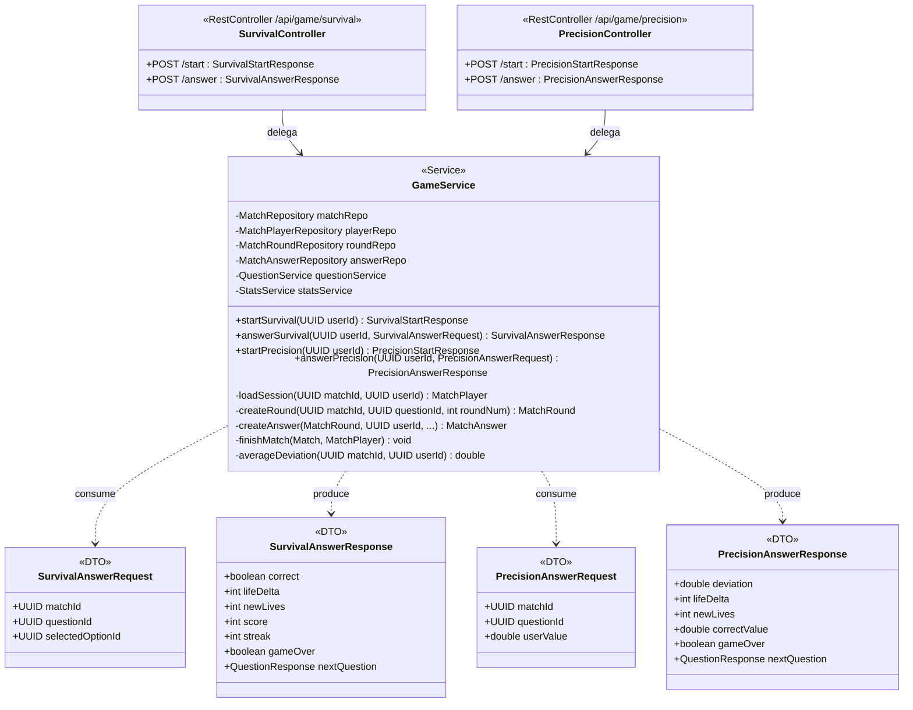
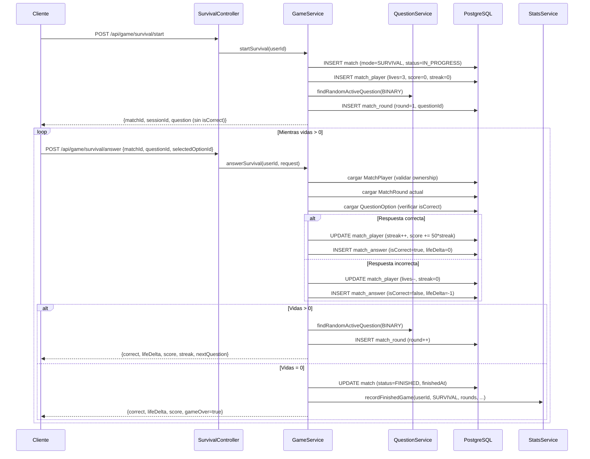
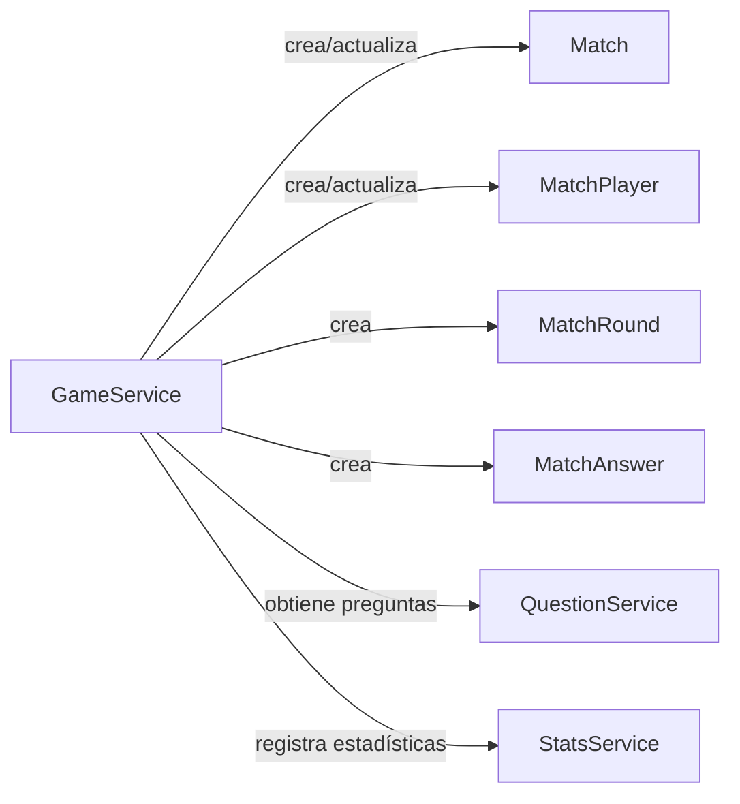

# Módulo: Juego singleplayer

Paquete raíz: `com.versus.api.game`  
Depende de: `match`, `questions`, `stats`  
Estado: ✅ implementado (Sprint 1-2)

---

## Responsabilidad

Implementa los dos modos de juego para un solo jugador: **Survival** (preguntas BINARY, vidas) y **Precision** (preguntas NUMERIC, daño por desviación). Crea y gestiona la sesión de partida (`Match` + `MatchPlayer`) y delega al módulo `stats` al finalizar.

---

## Modos de juego

### Survival
- Preguntas de tipo `BINARY`
- 3 vidas iniciales (`SURVIVAL_INITIAL_LIVES = 3`)
- Acierto: +0 vidas, puntos = `50 * streak_actual`
- Fallo: −1 vida
- Fin: vidas = 0

### Precision
- Preguntas de tipo `NUMERIC`
- 100 puntos de vida iniciales (`PRECISION_INITIAL_LIVES = 100`)
- Puntuación basada en desviación porcentual respecto al valor correcto
- Fallo total si la desviación supera el umbral definido (`tolerancePercent`)
- Fin: vidas ≤ 0

> ⚠️ **TODO #59:** La fórmula exacta de daño para Precision está pendiente de confirmación con el equipo. La implementación actual es aproximada.

---

## Diagrama de clases



---

## Flujo de una partida Survival



---

## Cálculo de puntuación Survival

```
Acierto:  score += 50 × streak_actual
          streak++
          lifeDelta = 0

Fallo:    score += 0
          streak = 0
          lives--
          lifeDelta = -1
```

Ejemplo de partida: `[✓✓✓✗✓✓]` → puntuaciones acumuladas: `50, 150, 300, 0, 50, 150`

---

## Cálculo de desviación Precision

```
desviación = |respuesta_usuario - correctValue| / correctValue × 100

Si desviación ≤ tolerancePercent (default 5%):
    lifeDelta = 0  (acierto perfecto / dentro del margen)

Si desviación > tolerancePercent:
    lifeDelta = -round(desviación)  ← pendiente confirmación TODO#59
```

---

## Endpoints

### Survival

| Método | Ruta | Body | Respuesta |
|---|---|---|---|
| `POST` | `/api/game/survival/start` | — | `SurvivalStartResponse` |
| `POST` | `/api/game/survival/answer` | `SurvivalAnswerRequest` | `SurvivalAnswerResponse` |

### Precision

| Método | Ruta | Body | Respuesta |
|---|---|---|---|
| `POST` | `/api/game/precision/start` | — | `PrecisionStartResponse` |
| `POST` | `/api/game/precision/answer` | `PrecisionAnswerRequest` | `PrecisionAnswerResponse` |

### Errores comunes

| Situación | ErrorCode | HTTP |
|---|---|---|
| Match no encontrado o no pertenece al usuario | `NOT_FOUND` / `FORBIDDEN` | 404 / 403 |
| Partida ya finalizada | `CONFLICT` | 409 |
| No hay preguntas disponibles | `NOT_FOUND` | 404 |

---

## Relación con otros módulos



`GameService` es el único componente que escribe en `Match*` durante el juego singleplayer. El futuro multiplayer tendrá su propio service con WebSocket.

---

## Extensión futura

- Los modos **Binary Duel**, **Precision Duel** y **Sabotage** usan las mismas entidades `Match*` pero se orquestan mediante WebSocket (Sprint 3).
- Añadir un endpoint `GET /api/game/{matchId}/summary` para historial de partida.
- Considerar SSE (Server-Sent Events) para un timer server-side en modos con tiempo límite.
