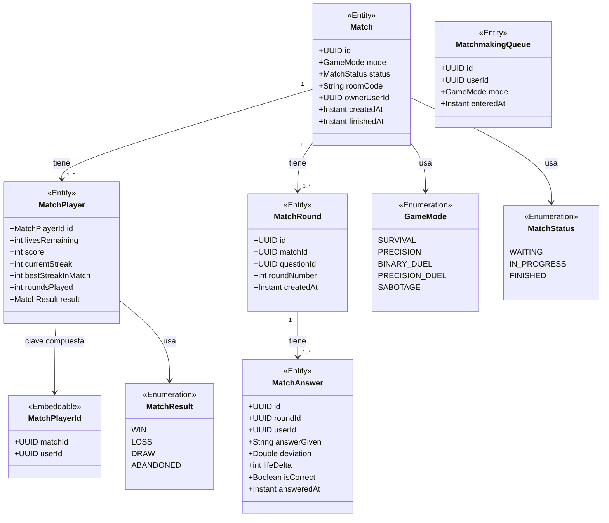
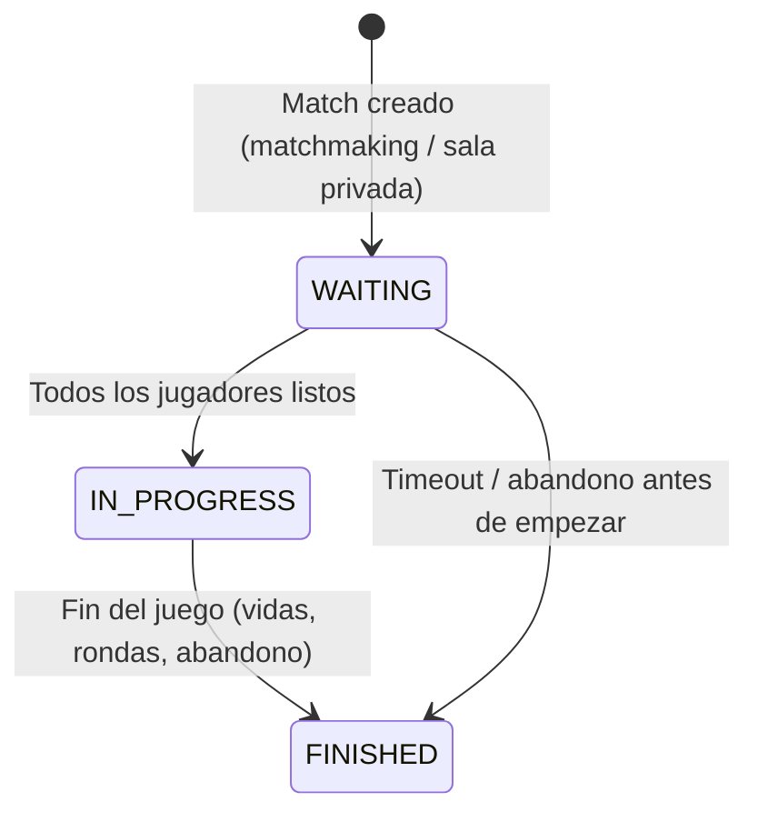

# Módulo: Partidas & Matchmaking

Paquete raíz: `com.versus.api.match`  
Depende de: `users`, `questions`  
Estado: 🚧 Entidades definidas — lógica de matchmaking y WebSocket pendiente (Sprint 3)

---

## Responsabilidad

Define las entidades de datos que representan una partida completa, sus jugadores, rondas y respuestas. En Sprint 3 se añadirán los controladores WebSocket y la lógica de emparejamiento.

---

## Diagrama de clases



---

## Ciclo de vida de una partida



---

## Entidades

### `Match`

```
Tabla: matches
┌──────────────┬──────────────────────────────────────────────────────┐
│ Columna      │ Notas                                                │
├──────────────┼──────────────────────────────────────────────────────┤
│ id           │ UUID, PK                                             │
│ mode         │ ENUM(GameMode)                                       │
│ status       │ ENUM(WAITING, IN_PROGRESS, FINISHED)                │
│ room_code    │ VARCHAR(16), nullable (salas privadas)               │
│ owner_user_id│ UUID (quien creó la sala)                            │
│ created_at   │ TIMESTAMPTZ                                          │
│ finished_at  │ TIMESTAMPTZ, nullable                                │
└──────────────┴──────────────────────────────────────────────────────┘
```

### `MatchPlayer`

Clave compuesta `(match_id, user_id)` — un usuario sólo puede estar una vez por partida.

```
Tabla: match_players
┌──────────────────┬──────────────────────────────────────────────────┐
│ Columna          │ Notas                                            │
├──────────────────┼──────────────────────────────────────────────────┤
│ match_id         │ UUID, PK parte 1                                 │
│ user_id          │ UUID, PK parte 2                                 │
│ lives_remaining  │ INT, inicializado según modo                     │
│ score            │ INT, default 0                                   │
│ current_streak   │ INT, default 0                                   │
│ best_streak      │ INT, default 0                                   │
│ rounds_played    │ INT, default 0                                   │
│ result           │ ENUM(MatchResult), nullable hasta finalizar      │
└──────────────────┴──────────────────────────────────────────────────┘
```

### `MatchRound`

Cada ronda corresponde a una pregunta en la partida.

```
Tabla: match_rounds
┌──────────────┬──────────────────────────────────────────────────────┐
│ Columna      │ Notas                                                │
├──────────────┼──────────────────────────────────────────────────────┤
│ id           │ UUID, PK                                             │
│ match_id     │ UUID, FK → matches.id (indexed)                     │
│ question_id  │ UUID, FK → questions.id                             │
│ round_number │ INT, posición dentro de la partida                  │
│ created_at   │ TIMESTAMPTZ                                          │
└──────────────┴──────────────────────────────────────────────────────┘
```

### `MatchAnswer`

Una respuesta por jugador por ronda.

```
Tabla: match_answers
┌──────────────┬──────────────────────────────────────────────────────┐
│ Columna      │ Notas                                                │
├──────────────┼──────────────────────────────────────────────────────┤
│ id           │ UUID, PK                                             │
│ round_id     │ UUID, FK → match_rounds.id (indexed)                │
│ user_id      │ UUID (indexed)                                       │
│ answer_given │ VARCHAR, nullable (id de opción o valor numérico)    │
│ deviation    │ DOUBLE, nullable (solo NUMERIC)                      │
│ life_delta   │ INT (cambio de vidas: 0 o negativo)                  │
│ is_correct   │ BOOLEAN, nullable (null = sin responder / timeout)  │
│ answered_at  │ TIMESTAMPTZ                                          │
└──────────────┴──────────────────────────────────────────────────────┘
```

### `MatchmakingQueue`

Cola de emparejamiento por modo.

```
Tabla: matchmaking_queue
┌──────────────┬──────────────────────────────────────────────────────┐
│ Columna      │ Notas                                                │
├──────────────┼──────────────────────────────────────────────────────┤
│ id           │ UUID, PK                                             │
│ user_id      │ UUID                                                 │
│ mode         │ ENUM(GameMode)                                       │
│ entered_at   │ TIMESTAMPTZ (indexed con mode para FIFO por modo)   │
└──────────────┴──────────────────────────────────────────────────────┘
Índice: (mode, entered_at) — permite matchmaking FIFO por modo
```

---

## WebSocket (Sprint 3 — pendiente)

El canal de comunicación en tiempo real usará STOMP sobre WebSocket:

```
Endpoint:  ws://localhost:8080/ws
Suscripciones:
  /user/queue/match        → mensajes privados al jugador
  /topic/match/{matchId}  → sala compartida de la partida
Envío desde cliente:
  /app/match/answer        → enviar respuesta
  /app/match/ready         → confirmar listo para empezar
```

Los mensajes del servidor seguirán el mismo formato de DTO que la API REST.

---

## Modos multijugador planificados (Sprint 3)

| Modo | Jugadores | Mecánica |
|---|---|---|
| `BINARY_DUEL` | 2 | Cada uno responde en paralelo; gana el primero en llegar a X aciertos |
| `PRECISION_DUEL` | 2 | Menor desviación acumulada gana |
| `SABOTAGE` | 2-4 | Respuesta correcta añade vidas; opción especial roba vidas al rival |

---

## Extensión futura

- Implementar `MatchmakingService` con lógica de emparejamiento FIFO.
- Implementar `MatchWebSocketHandler` con `@MessageMapping`.
- Añadir timeout por ronda (Spring `@Scheduled` o WebSocket heartbeat).
- Salas privadas con `roomCode` para jugar con amigos.
