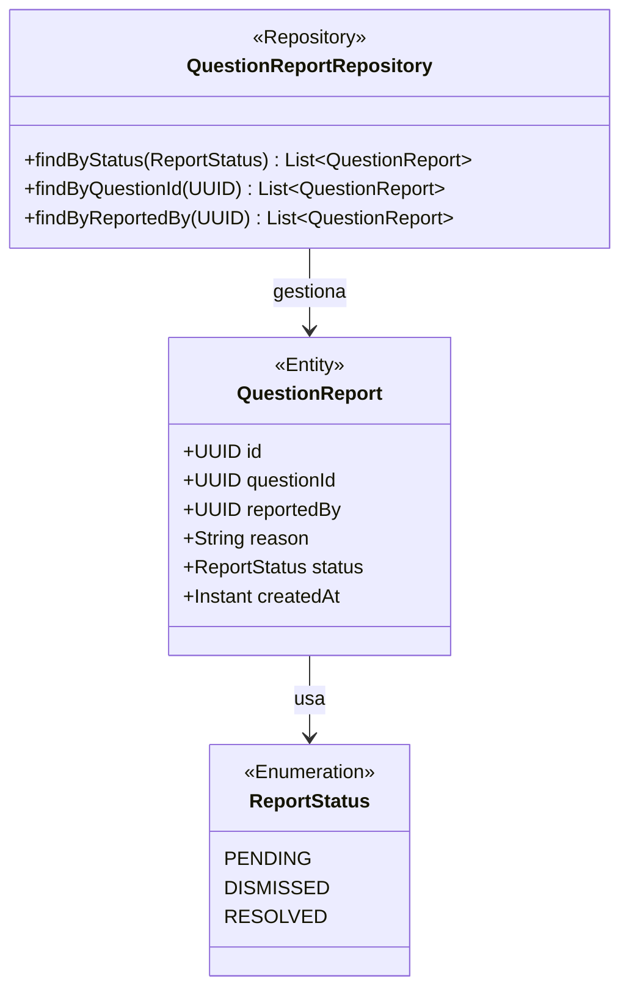
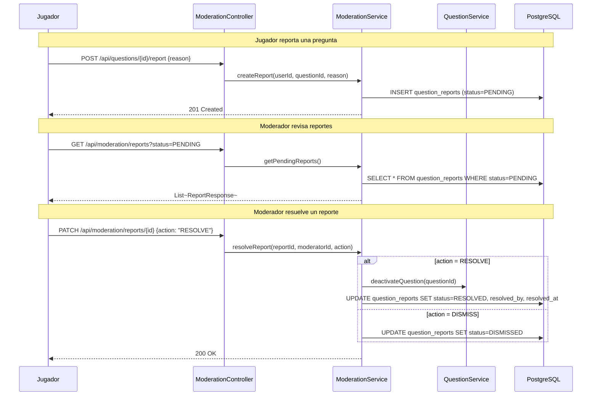

# Módulo: Moderación

Paquete raíz: `com.versus.api.moderation`  
Estado: 🚧 Entidades definidas — controladores y servicio pendientes (Sprint 4)

---

## Responsabilidad

Permite a los jugadores reportar preguntas incorrectas o inapropiadas, y a los moderadores/admins revisar y resolver esos reportes (aprobar → desactivar pregunta, desestimar → ignorar el reporte).

---

## Diagrama de clases



---

## Flujo planificado (Sprint 4)



---

## Entidad: `QuestionReport`

```
Tabla: question_reports
┌──────────────┬──────────────────────────────────────────────────────┐
│ Columna      │ Notas                                                │
├──────────────┼──────────────────────────────────────────────────────┤
│ id           │ UUID, PK                                             │
│ question_id  │ UUID, FK → questions.id                             │
│ reported_by  │ UUID, FK → users.id                                 │
│ reason       │ VARCHAR(500), descripción del problema               │
│ status       │ ENUM(PENDING, DISMISSED, RESOLVED), default PENDING  │
│ created_at   │ TIMESTAMPTZ                                          │
└──────────────┴──────────────────────────────────────────────────────┘

Campos pendientes (Sprint 4):
  resolved_by    UUID, nullable → moderador que lo resolvió
  resolved_at    TIMESTAMPTZ, nullable
  resolution_note VARCHAR(500), nullable → motivo de la resolución
```

---

## Endpoints planificados (Sprint 4)

| Método | Ruta | Rol | Descripción |
|---|---|---|---|
| `POST` | `/api/questions/{id}/report` | PLAYER+ | Crear reporte |
| `GET` | `/api/moderation/reports` | MODERATOR+ | Listar reportes (filtro por status) |
| `PATCH` | `/api/moderation/reports/{id}` | MODERATOR+ | Resolver o desestimar |
| `GET` | `/api/moderation/reports/{id}` | MODERATOR+ | Ver detalle de un reporte |

---

## Reglas de negocio planificadas

1. Un usuario no puede reportar la misma pregunta más de una vez mientras el reporte esté `PENDING`.
2. Resolver un reporte (`RESOLVE`) desactiva automáticamente la pregunta (`status = INACTIVE`).
3. Los reportes `DISMISSED` o `RESOLVED` no bloquean nuevos reportes sobre la misma pregunta.
4. Los usuarios pueden ver sus propios reportes; los moderadores ven todos.
