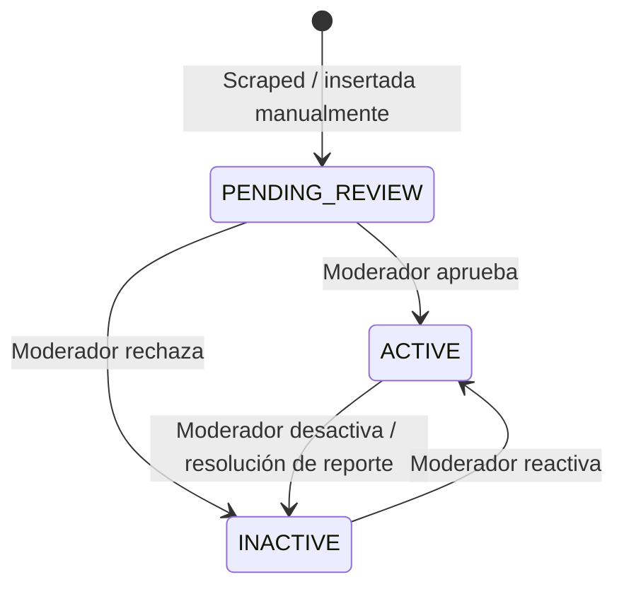

# Módulo: Preguntas

Paquete raíz: `com.versus.api.questions`  
Estado: ✅ implementado (Sprint 1)

---

## Responsabilidad

Almacena y sirve las preguntas del juego. Las preguntas las inserta el scraper (Sprint 4) o el seeder de dev. Este módulo **nunca expone las respuestas correctas** al cliente en los endpoints de consulta — eso lo gestiona el módulo `game` internamente.

---

## Dos tipos de pregunta

| Tipo | Descripción | Respuesta |
|---|---|---|
| `BINARY` | El jugador elige entre varias opciones de texto | `QuestionOption` con `isCorrect = true` |
| `NUMERIC` | El jugador introduce un valor numérico | `correctValue` + `unit` + `tolerancePercent` |

---

## Diagrama de clases

```mermaid
classDiagram
    class QuestionController {
        <<RestController>>
        +GET /api/questions/random
        +GET /api/questions/{id}
        +GET /api/questions/categories
    }

    class QuestionService {
        <<Service>>
        -QuestionRepository questionRepo
        +getRandom(QuestionType, String) QuestionResponse
        +getById(UUID) QuestionResponse
        +getCategories() List~String~
        +findRandomActiveQuestion(QuestionType, String) Question
        +findActiveQuestion(UUID) Question
        -toResponse(Question) QuestionResponse
    }

    class Question {
        <<Entity>>
        <<Table: questions>>
        +UUID id
        +String text
        +QuestionType type
        +String category
        +String sourceUrl
        +Instant scrapedAt
        +QuestionStatus status
        +BigDecimal correctValue
        +String unit
        +BigDecimal tolerancePercent
        +List~QuestionOption~ options
    }

    class QuestionOption {
        <<Entity>>
        <<Table: question_options>>
        +UUID id
        +Question question
        +String text
        +boolean isCorrect
    }

    class QuestionType {
        <<Enumeration>>
        BINARY
        NUMERIC
    }

    class QuestionStatus {
        <<Enumeration>>
        PENDING_REVIEW
        ACTIVE
        INACTIVE
    }

    class QuestionRepository {
        <<Repository>>
        +findRandomActive(QuestionType, String) Optional~Question~
        +findRandomActive(QuestionType) Optional~Question~
        +findByIdAndStatus(UUID, QuestionStatus) Optional~Question~
        +findDistinctCategoriesByStatus(QuestionStatus) List~String~
    }

    class QuestionBinaryResponse {
        <<DTO>>
        +UUID id
        +String text
        +String type = "BINARY"
        +String category
        +List~OptionDto~ options
    }

    class QuestionNumericResponse {
        <<DTO>>
        +UUID id
        +String text
        +String type = "NUMERIC"
        +String category
        +String unit
    }

    class QuestionResponse {
        <<Interface / Sealed>>
    }

    QuestionController --> QuestionService : delega
    QuestionService --> QuestionRepository : consulta
    QuestionRepository --> Question : gestiona
    Question --> QuestionOption : contiene (1..*)
    Question --> QuestionType : usa
    Question --> QuestionStatus : usa
    QuestionService ..> QuestionBinaryResponse : produce
    QuestionService ..> QuestionNumericResponse : produce
    QuestionBinaryResponse ..|> QuestionResponse
    QuestionNumericResponse ..|> QuestionResponse
```

---

## Endpoints

| Método | Ruta | Auth | Parámetros | Respuesta |
|---|---|---|---|---|
| `GET` | `/api/questions/random` | No | `?type=BINARY&category=football` | `200` `QuestionResponse` |
| `GET` | `/api/questions/{id}` | No | — | `200` `QuestionResponse` |
| `GET` | `/api/questions/categories` | No | — | `200` `List<String>` |

Los parámetros de `/random` son opcionales: si se omite `type`, devuelve cualquier tipo; si se omite `category`, devuelve cualquier categoría activa.

### Seguridad de datos en las respuestas

```
BINARY  → NO se incluye QuestionOption.isCorrect
NUMERIC → NO se incluye Question.correctValue ni tolerancePercent
```

La respuesta para NUMERIC sólo expone `unit` para que el frontend pueda formatear el input del usuario. El módulo `game` accede directamente a la entidad para comprobar la respuesta.

### Errores comunes

| Situación | ErrorCode | HTTP |
|---|---|---|
| No hay preguntas activas con los filtros dados | `NOT_FOUND` | 404 |
| Pregunta con ese ID no existe o está inactiva | `NOT_FOUND` | 404 |

---

## Entidades

### `Question`

```
Tabla: questions
┌──────────────────┬──────────────────────────────────────────────────┐
│ Columna          │ Notas                                            │
├──────────────────┼──────────────────────────────────────────────────┤
│ id               │ UUID, PK                                         │
│ text             │ TEXT, NOT NULL                                   │
│ type             │ ENUM(BINARY, NUMERIC)                            │
│ category         │ VARCHAR(100), nullable                           │
│ source_url       │ VARCHAR(500), nullable (origen del scraper)      │
│ scraped_at       │ TIMESTAMPTZ, nullable                            │
│ status           │ ENUM, default PENDING_REVIEW                     │
│ correct_value    │ NUMERIC(15,4), nullable (solo NUMERIC)           │
│ unit             │ VARCHAR(50), nullable (ej: "km", "años")         │
│ tolerance_percent│ NUMERIC(5,2), default 5 (±5% es acierto)        │
└──────────────────┴──────────────────────────────────────────────────┘
Índice: (status, type, category)
```

### `QuestionOption`

```
Tabla: question_options
┌──────────────┬──────────────────────────────────────────────────────┐
│ Columna      │ Notas                                                │
├──────────────┼──────────────────────────────────────────────────────┤
│ id           │ UUID, PK                                             │
│ question_id  │ UUID, FK → questions.id (CASCADE DELETE)            │
│ text         │ VARCHAR(255), NOT NULL                               │
│ is_correct   │ BOOLEAN, NOT NULL                                    │
└──────────────┴──────────────────────────────────────────────────────┘
```

Las opciones se eliminan en cascada cuando se elimina la pregunta (`orphanRemoval = true`).

---

## Aleatoriedad

La consulta de pregunta aleatoria usa SQL nativo con `ORDER BY random()`:

```sql
SELECT * FROM questions
WHERE status = 'ACTIVE'
  AND type = :type
  AND (:category IS NULL OR category = :category)
ORDER BY random()
LIMIT 1
```

> **Nota de rendimiento:** `ORDER BY random()` hace un full-scan en PostgreSQL. Con volúmenes altos de preguntas, considerar `TABLESAMPLE SYSTEM` o una columna `random_weight` actualizada periódicamente.

---

## Ciclo de vida de una pregunta



Las preguntas en `PENDING_REVIEW` e `INACTIVE` nunca aparecen en los endpoints públicos ni en las partidas.

---

## Extensión futura

- Endpoint `POST /api/questions` para que el admin inserte preguntas manualmente.
- Endpoint `PATCH /api/questions/{id}/status` para moderación directa.
- Paginación en `/api/questions` para el panel de administración.
- Cache de categorías (cambian poco y se consultan frecuentemente).
