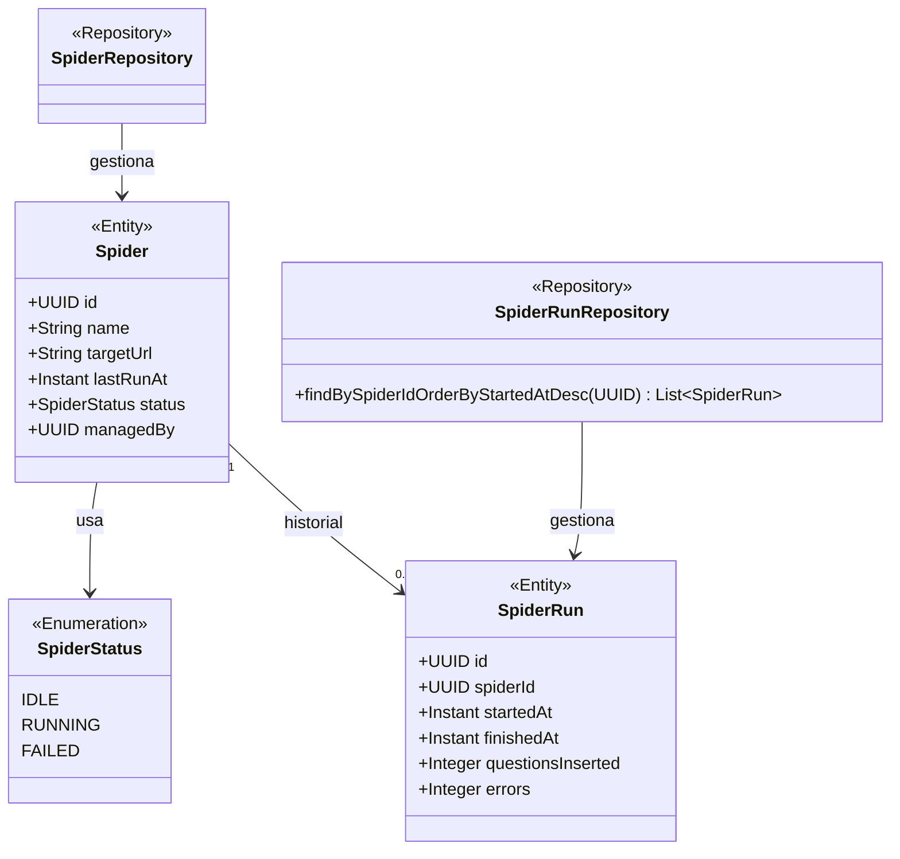
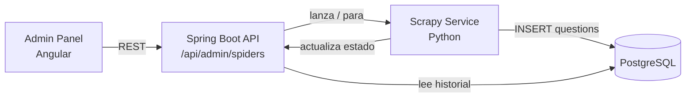
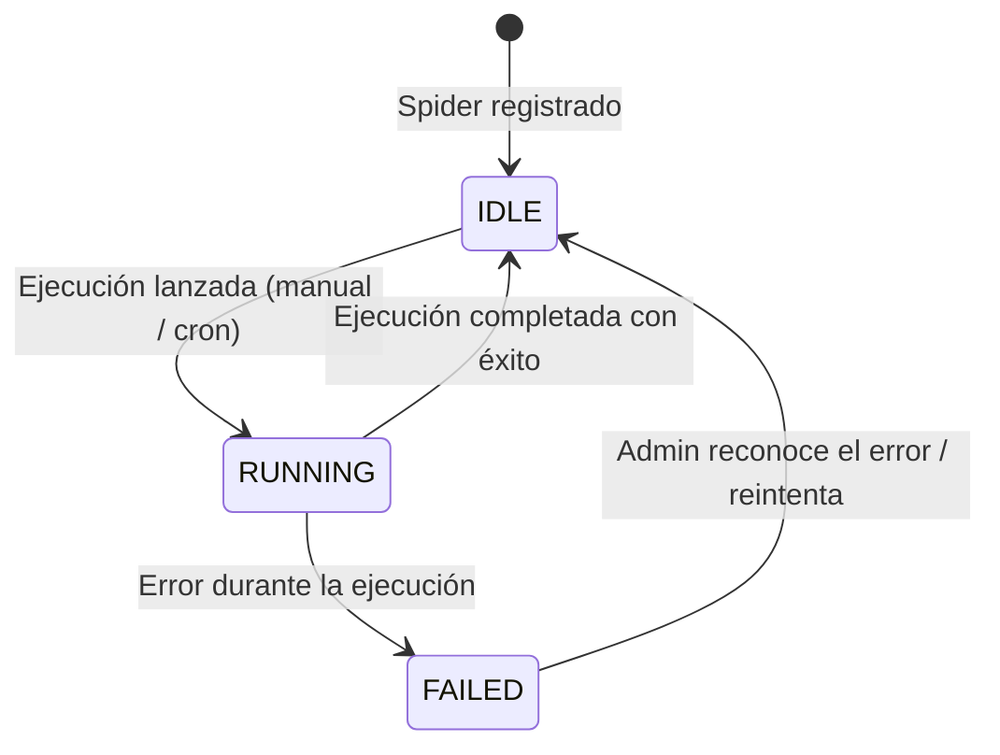

# Módulo: Scraping

Paquete raíz: `com.versus.api.scraping`  
Estado: 🚧 Entidades definidas — integración con Scrapy pendiente (Sprint 4)

---

## Responsabilidad

Gestiona los spiders de scraping (Scrapy) que insertan preguntas en la BD. Registra qué spiders existen, quién los administra, y lleva el historial de ejecuciones con métricas de calidad.

---

## Diagrama de clases



---

## Entidades

### `Spider`

Representa un script Scrapy desplegado. Un spider apunta a una fuente web concreta y extrae preguntas de un tema/categoría.

```
Tabla: spiders
┌──────────────┬──────────────────────────────────────────────────────┐
│ Columna      │ Notas                                                │
├──────────────┼──────────────────────────────────────────────────────┤
│ id           │ UUID, PK                                             │
│ name         │ VARCHAR(100), nombre descriptivo del spider          │
│ target_url   │ VARCHAR(500), URL base que crawlea                   │
│ last_run_at  │ TIMESTAMPTZ, nullable                                │
│ status       │ ENUM(IDLE, RUNNING, FAILED), default IDLE            │
│ managed_by   │ UUID, nullable → usuario ADMIN que lo gestiona       │
└──────────────┴──────────────────────────────────────────────────────┘
```

### `SpiderRun`

Historial de ejecuciones de un spider.

```
Tabla: spider_runs
┌────────────────────┬────────────────────────────────────────────────┐
│ Columna            │ Notas                                          │
├────────────────────┼────────────────────────────────────────────────┤
│ id                 │ UUID, PK                                       │
│ spider_id          │ UUID, FK → spiders.id                         │
│ started_at         │ TIMESTAMPTZ                                    │
│ finished_at        │ TIMESTAMPTZ, nullable (null si aún corre)      │
│ questions_inserted │ INT, nullable (cuántas preguntas se insertaron)│
│ errors             │ INT, nullable (errores durante la ejecución)   │
└────────────────────┴────────────────────────────────────────────────┘
```

---

## Arquitectura de integración planificada (Sprint 4)



El pipeline Scrapy inserta preguntas directamente en la tabla `questions` con `status = PENDING_REVIEW`. Un moderador las revisa antes de que aparezcan en partidas.

---

## Endpoints planificados (Sprint 4)

| Método | Ruta | Rol | Descripción |
|---|---|---|---|
| `GET` | `/api/admin/spiders` | ADMIN | Listar todos los spiders y su estado |
| `POST` | `/api/admin/spiders/{id}/run` | ADMIN | Lanzar ejecución manual |
| `GET` | `/api/admin/spiders/{id}/runs` | ADMIN | Historial de ejecuciones |
| `PATCH` | `/api/admin/spiders/{id}` | ADMIN | Actualizar configuración del spider |

---

## Ciclo de vida de un spider



---

## Reglas de negocio planificadas

1. Un spider en `RUNNING` no puede lanzarse de nuevo hasta que termine o falle.
2. Las preguntas insertadas por el scraper siempre llegan con `status = PENDING_REVIEW`.
3. El campo `errors` en `SpiderRun` registra el número de URLs que fallaron, no errores fatales.
4. Sólo un ADMIN puede lanzar o pausar un spider.
