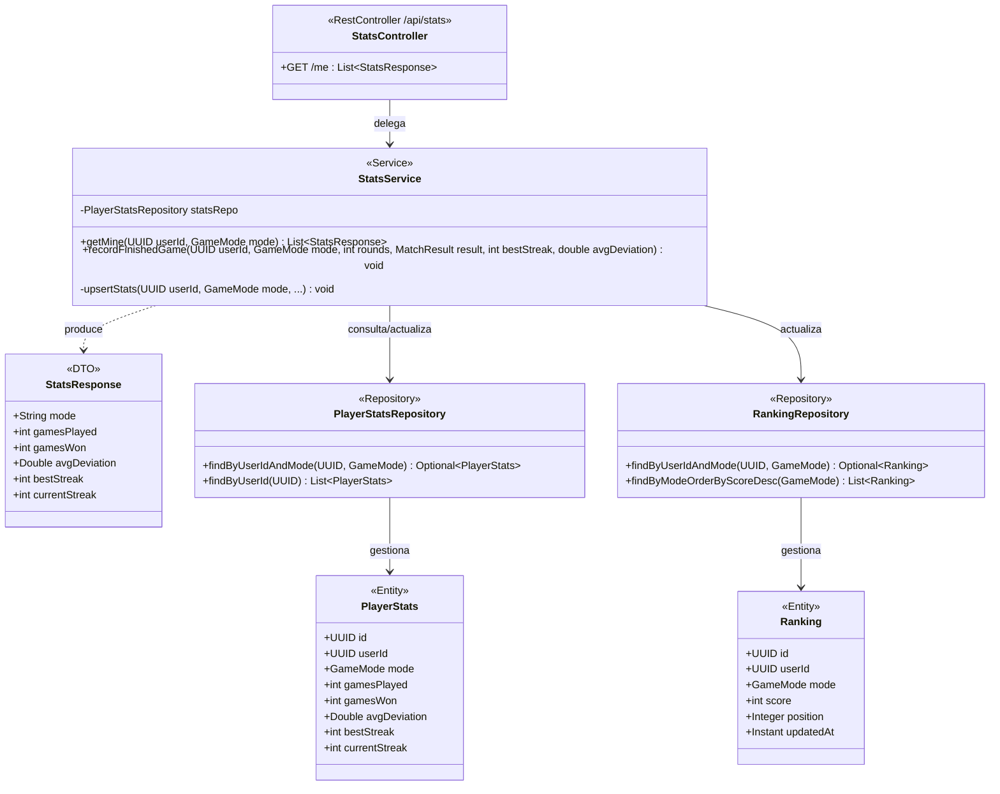
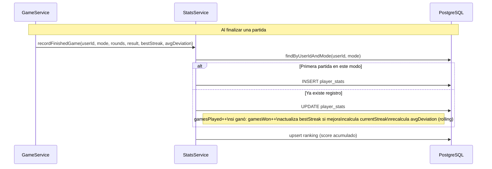

# Módulo: Estadísticas & Ranking

Paquete raíz: `com.versus.api.stats`  
Estado: ✅ implementado (Sprint 1-2)

---

## Responsabilidad

Acumula las estadísticas de juego del usuario por modo (`PlayerStats`) y mantiene la tabla de clasificación global (`Ranking`). Se actualiza automáticamente al finalizar una partida mediante `StatsService.recordFinishedGame()`, llamado por `GameService`.

---

## Diagrama de clases



---

## Flujo de actualización de estadísticas



---

## Lógica de estadísticas

### ¿Cuándo se cuenta una victoria?

| Modo | Condición de victoria |
|---|---|
| `SURVIVAL` | `rounds >= 5` (el jugador sobrevivió al menos 5 rondas) |
| `PRECISION` | `result == WIN` (debe igualar o superar al rival, o meta marcada) |
| `BINARY_DUEL` | `result == WIN` |
| `PRECISION_DUEL` | `result == WIN` |
| `SABOTAGE` | `result == WIN` |

### Actualización de streaks

```
currentStreak:
  - Si ganó: currentStreak++
  - Si no ganó (LOSS / DRAW / ABANDONED): currentStreak = 0

bestStreak:
  - bestStreak = max(bestStreak, bestStreakInMatch)
  donde bestStreakInMatch viene del MatchPlayer.bestStreakInMatch
```

### Desviación media (modo Precision)

Se usa una media móvil incremental para evitar guardar todo el historial:

```
avgDeviation_nuevo = ((avgDeviation_anterior * (gamesPlayed - 1)) + avgDeviation_partida) / gamesPlayed
```

---

## Endpoints

| Método | Ruta | Auth | Parámetros | Respuesta |
|---|---|---|---|---|
| `GET` | `/api/stats/me` | Bearer | `?mode=SURVIVAL` (opcional) | `200` `List<StatsResponse>` |

Si se omite `mode`, devuelve estadísticas para todos los modos en los que el usuario haya jugado.

---

## Entidades

### `PlayerStats`

Única por `(user_id, mode)` — restricción `UNIQUE` en BD.

```
Tabla: player_stats
┌──────────────────┬──────────────────────────────────────────────────┐
│ Columna          │ Notas                                            │
├──────────────────┼──────────────────────────────────────────────────┤
│ id               │ UUID, PK                                         │
│ user_id          │ UUID (parte del UNIQUE con mode)                 │
│ mode             │ ENUM(GameMode) (parte del UNIQUE con user_id)    │
│ games_played     │ INT, default 0                                   │
│ games_won        │ INT, default 0                                   │
│ avg_deviation    │ DOUBLE, nullable (solo relevante en PRECISION)   │
│ best_streak      │ INT, default 0                                   │
│ current_streak   │ INT, default 0                                   │
└──────────────────┴──────────────────────────────────────────────────┘
```

### `Ranking`

```
Tabla: rankings
┌──────────────┬──────────────────────────────────────────────────────┐
│ Columna      │ Notas                                                │
├──────────────┼──────────────────────────────────────────────────────┤
│ id           │ UUID, PK                                             │
│ user_id      │ UUID                                                 │
│ mode         │ ENUM(GameMode)                                       │
│ score        │ INT (puntuación acumulada)                           │
│ position     │ INT, nullable (recalculado por job periódico)        │
│ updated_at   │ TIMESTAMPTZ                                          │
└──────────────┴──────────────────────────────────────────────────────┘
Índice: (mode, score DESC) — consultas rápidas de top N por modo
```

La columna `position` se actualiza mediante un job o procedimiento almacenado (aún no implementado).

---

## Extensión futura (Sprint 4)

- Endpoint `GET /api/rankings?mode=SURVIVAL&limit=20` para el leaderboard global.
- Endpoint `GET /api/stats/{userId}` para ver estadísticas de otro jugador (público).
- Job `@Scheduled` para recalcular `position` en la tabla de rankings periódicamente.
- Soporte de estadísticas de temporada (con campo `season` en `PlayerStats`).
