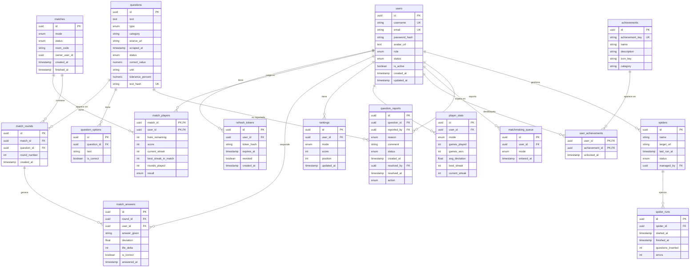

# Esquema de Base de Datos

En este documento se presenta el esquema de la base de datos para el sistema de preguntas y respuestas. El esquema está diseñado para soportar funcionalidades como gestión de usuarios, autenticación con refresh tokens, preguntas, partidas, rankings, estadísticas y reportes. A continuación se muestra el diagrama entidad-relación que representa las tablas principales y sus relaciones:

## Cambios respecto a la versión inicial (Sprint 1)

| Cambio | Motivo |
|---|---|
| `users.is_active`, `users.updated_at` | Soft-deactivation de cuentas y auditoría. |
| `users.status` | Estado funcional de cuenta (`ACTIVE`, `DELETED`) para soft delete explicito. |
| `users.avatar_url` como TEXT | Permite guardar temporalmente avatares subidos como `data:image/...;base64` hasta tener almacenamiento externo. |
| `users.email` y `users.username` con UNIQUE | Garantiza unicidad para login y registro. |
| Nueva tabla `refresh_tokens` | JWT con rotación: hash + expiración + flag de revocado. |
| `questions.correct_value` (NUMERIC) sustituye a `correct_answer` (string) | Tipado correcto para modo PRECISION. |
| `questions.unit` (string) | Unidad de la respuesta numérica (ej. "millones", "%", "goles"). |
| `questions.tolerance_percent` (NUMERIC, default 5) | Margen de error aceptado en PRECISION. |
| `match_players` con clave compuesta `(match_id, user_id)` | Modelado correcto de la relación N:M. |
| `match_players.current_streak`, `best_streak_in_match`, `rounds_played` | Estado de partida singleplayer (Survival/Precision). |
| `match_answers.is_correct` | Permite filtros y stats sin recalcular desviación. |
| `matches.owner_user_id` | Identifica al dueño/host (singleplayer = único jugador). |
| Nuevas tablas `achievements` y `user_achievements` | Catalogo de logros y desbloqueos unicos por usuario. |

## Cambios introducidos en issue #100 (Moderación)

| Cambio | Motivo |
|---|---|
| `question_reports.reason` cambia de `string` a `enum` | Valores controlados: `WRONG_ANSWER`, `OUTDATED`, `OFFENSIVE`, `OTHER`. |
| `question_reports.comment TEXT` (nuevo) | Comentario libre opcional del jugador al reportar. |
| `question_reports.resolved_by UUID FK(users)` (nuevo) | Quién resolvió el reporte. |
| `question_reports.resolved_at TIMESTAMP` (nuevo) | Cuándo se resolvió. |
| `question_reports.action enum` (nuevo) | Acción tomada al resolver: `DISMISS`, `EDIT_QUESTION`, `DELETE_QUESTION`. |
| `questions.status` añade valor `FLAGGED` | Pregunta auto-flaggeada al acumular 5 reportes PENDING. Deja de servirse en partidas. |

## Cambios introducidos en issue #97 (Pipeline Scrapy)

| Cambio | Motivo |
|---|---|
| `questions.text_hash VARCHAR(64) UNIQUE` | Deduplicación idempotente en el pipeline Scrapy: SHA-256 del texto de la pregunta. Permite ejecutar el mismo spider varias veces sin crear duplicados. |

## Índices

- `users(email)` UNIQUE, `users(username)` UNIQUE.
- `questions(status, type, category)` compuesto (filtro frecuente para `/api/questions/random`).
- `questions(text_hash)` UNIQUE (deduplicación del pipeline Scrapy).
- `rankings(mode, score DESC)`.
- `matchmaking_queue(mode, entered_at)`.
- `match_rounds(match_id)`, `match_answers(round_id)`, `match_answers(user_id)`.
- `refresh_tokens(user_id)`, `refresh_tokens(token_hash)`.
- `achievements(achievement_key)` UNIQUE, `achievements(category)`.
- `user_achievements(user_id, achievement_id)` PK compuesta.

Por si no se visualiza bien, también se presentan las imágenes del esquema:

[Esquema de Base de Datos](img/scheme-black.svg)

[Esquema de Base de Datos](img/scheme.svg)

[Esquema de Base de Datos](img/scheme-white.svg)
