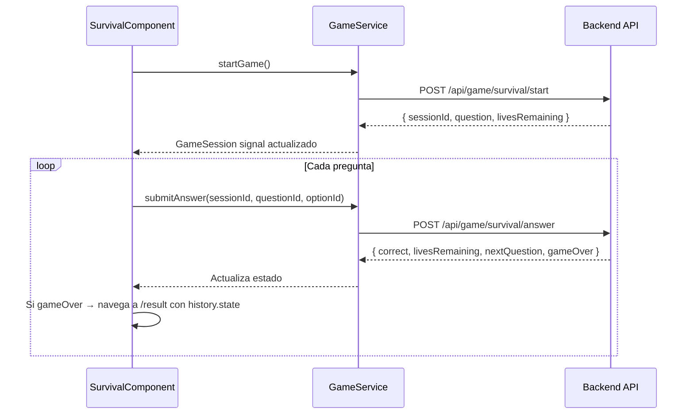

# Arquitectura del frontend

## Stack y principios

| Tecnología | Versión | Uso |
|---|---|---|
| Angular | 21 | Framework principal |
| TypeScript | 5.x | Lenguaje |
| Vitest | — | Tests unitarios |
| RxJS | 7.x | Streams HTTP y eventos |
| Angular Signals | nativo | Estado reactivo en servicios |

**Principios de diseño:**

- Componentes **standalone** — sin NgModules.
- **Sin lógica en templates** — solo bindings y directivas. La lógica vive en el componente o en un servicio.
- Estado del juego (vidas, puntuación, timer) en **servicios con signals**, nunca en variables locales del componente.
- Comunicación entre componentes con `@Input()` / `@Output()`. Para estado global, inyectar el servicio.

## Estructura de carpetas

```
frontend/src/app/
├── app.config.ts        Proveedores globales (HttpClient, AuthInterceptor, router)
├── app.routes.ts        Árbol de rutas (todos con loadComponent lazy)
│
├── core/                Capa de infraestructura transversal
│   ├── guards/          authGuard, adminGuard
│   ├── interceptors/    AuthInterceptor (Bearer token + refresh)
│   ├── models/          Interfaces TypeScript (auth, game, websocket)
│   └── services/        Servicios singleton (Auth, User, Game, Stats, WebSocket)
│
├── shared/
│   ├── components/ui/   Componentes de UI reutilizables (vs-button, vs-card, vs-input…)
│   └── pipes/           Pipes compartidos (pendiente)
│
└── features/            Un módulo por área funcional
    ├── landing/         Página pública
    ├── auth/            Login y registro
    ├── player/          Dashboard, perfil, selección de modo, lobby, resultado
    ├── survival/        Página + componentes del modo Survival
    ├── precision/       Página del modo Precision
    └── admin/           Panel de administración (ADMIN role)
```

## Routing

Todas las rutas usan `loadComponent` — Angular carga el chunk solo cuando el usuario navega a esa ruta.

```typescript
// Extracto de app.routes.ts
{
  path: 'dashboard',
  canActivate: [authGuard],
  loadComponent: () => import('./features/player/pages/dashboard/dashboard.component')
},
{
  path: 'admin',
  canActivate: [authGuard, adminGuard],
  loadComponent: () => import('./features/admin/pages/dashboard/admin-dashboard.component')
}
```

Guards disponibles:

| Guard | Condición | Redirige a |
|---|---|---|
| `authGuard` | `AuthService.isAuthenticated()` | `/login` |
| `adminGuard` | `AuthService.user()?.role === 'ADMIN'` | `/dashboard` |

## Gestión de estado con Signals

Los servicios de `core/services/` exponen signals reactivos. Los componentes los consumen directamente en el template con `{{ service.user() }}` o en lógica con `effect()`.

```typescript
// auth.service.ts
readonly user = signal<AuthUser | null>(null);
readonly isAuthenticated = computed(() => this.user() !== null);
```

El estado se inicializa leyendo `localStorage` al arrancar (`vs.accessToken`, `vs.refreshToken`, `vs.user`).

### Servicios disponibles

| Servicio | Responsabilidad | Signals expuestos |
|---|---|---|
| `AuthService` | Login, registro, refresh, logout | `user`, `isAuthenticated` |
| `UserService` | Perfil propio y público | — |
| `GameService` | Start/answer para Survival y Precision | — |
| `QuestionService` | Preguntas aleatorias con filtros | — |
| `StatsService` | Estadísticas del jugador | — |
| `WebSocketService` | Conexión STOMP + eventos de partida | (pendiente Sprint 3) |

## AuthInterceptor

Inyectado globalmente en `app.config.ts`. Actúa en todas las peticiones a `/api/**`:

1. Añade `Authorization: Bearer <accessToken>`.
2. Si la respuesta es `401`, intenta `POST /api/auth/refresh`.
3. Si el refresh tiene éxito, reintenta la petición original con el nuevo token.
4. Si el refresh también falla (token expirado), navega a `/login`.

## Componentes compartidos (shared/components/ui)

| Componente | Selector | Props principales |
|---|---|---|
| Button | `vs-button` | `variant` (`primary`/`danger`/`ghost`), `disabled`, `loading` |
| Card | `vs-card` | — (usa `ng-content` para proyectar contenido) |
| Input | `vs-input` | `type`, `placeholder`, `error`, `variant` (`numeric`) |
| Badge | `vs-badge` | `color`, `size` |
| Divider | `vs-divider` | `label` |

Todos usan los tokens CSS `--vs-*` definidos en `styles.scss`. Ver [style-guide.md](../style-guide.md) para la referencia completa.

## Convenciones de componentes

### Ficheros por componente

```
nombre/
├── nombre.component.ts      Lógica
├── nombre.component.html    Template
├── nombre.component.scss    Estilos (scoped)
└── nombre.component.spec.ts Tests (si aplica)
```

### Template

- Sin ternarios en el template — usar `@if` / `@for` (Angular 17+ control flow).
- Clases CSS con binding: `[class.animate-wrong]="condition"`, nunca con expresiones inline.
- Llamadas a servicios desde el componente, no desde el template.

### SCSS

- Todas las clases con prefijo `vs-` si van al global scope.
- Estilos locales del componente sin prefijo, en el fichero `.scss` del componente.
- No uses valores hardcoded para colores ni tipografía — usa siempre los tokens CSS.

## Modos de juego — flujo de datos



La página de resultado (`/result`) recibe los datos del juego por `history.state` (no por URL params) para no exponer scores en la URL.

## Módulo admin (Sprint 4)

Las páginas de admin están **mockeadas** hasta que el backend implemente los endpoints. Cada página tiene datos locales hardcodeados. Al implementar el backend, se reemplaza el mock por la llamada al servicio correspondiente.

Rutas admin:

| Ruta | Componente | Estado |
|---|---|---|
| `/admin` | AdminDashboardComponent | 🚧 Mocked |
| `/admin/spiders` | AdminSpidersComponent | 🚧 Mocked |
| `/admin/reports` | AdminReportsComponent | 🚧 Mocked |
| `/admin/users` | AdminUsersComponent | 🚧 Mocked |
